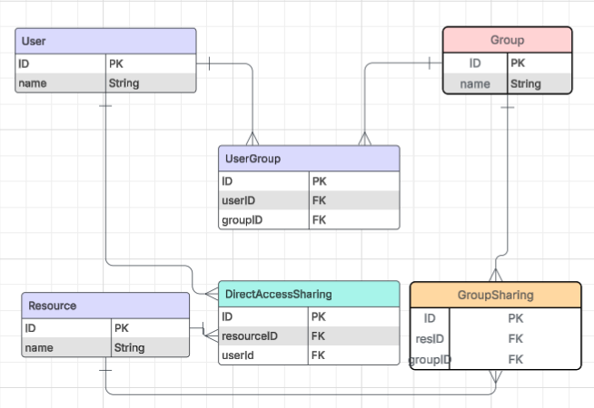
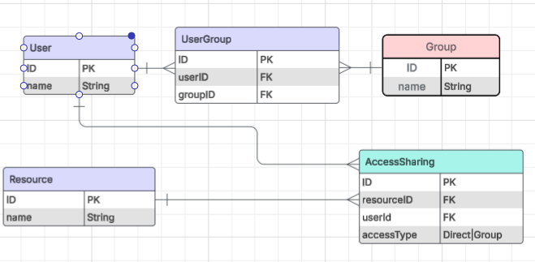

# Solution approach on Data Scheming

* status: ✔️ Done
* 🙋 Participants: `Erdenezul Batmunkh`
* 🙋 Deciders: `Erdenezul Batmunkh`
* 📆 Date started: `20.07.2025`

## 📚 Context

As outlined in `ADR #1`, I selected technologies based on familiarity and development velocity. For the database management system, I chose PostgreSQL due to its latest familiar technology to me and to save time. 

Given this choice of a relational DBMS, the schema design naturally followed a normalized, entity-relationship model. However, to address the challenge of overlapping access between users, groups, and shared resources, I evaluated two architectural approaches.

## Option Analysis

### Option 1: Join group sharing and direct sharing at query time

This option follows traditional data normalization principles, minimizing storage and redundancy — as we were taught in university.

However, solving the **overlapping access** problem here requires writing complex SQL queries that join `GroupSharing` and `DirectAccessSharing`, then deduplicate the results.

✅ Pros:
*	Data normalization: Keeps data DRY — you model real-world access paths (group vs. direct).
*	Traceable access paths: You can clearly see how a user has access (via group vs. direct).
*	No data duplication: Storage is minimal; only actual access paths are stored.

❌ Cons:
*	Complex queries: UNION, deduplicate, and paginate across both GroupSharing and DirectAccessSharing.
*	High computational cost: For large graphs (millions of users/resources), deduplication via joins/unions becomes slow.
*	Hard pagination: SQL pagination over unions with deduplication is tricky and inefficient (e.g., DISTINCT ON with LIMIT, or CTEs).
*	Hard to cache: User access must be computed on each query (unless you cache results).

### 💡Option 2: Precomputed AccessSharing edges (bipartite graph)

In this approach, I aim to use a single Resource table to return unique resources, regardless of `overlapping access`. The underlying logic treats the relationship between `User` and `AccessSharing` as a large bipartite graph. When a user **joins a group**, new edges are created by the backend logic—connecting the user to the relevant `AccessSharing` entries—if that group already has access to certain resources.

✅ Pros:
*	Fast queries
*	No expensive runtime computation; all access is precomputed.
*	Pagination is simple: Offset-based or cursor-based pagination works directly.

❌ Cons:

*	More storage: You’ll have more rows (e.g., if one group has 10 resources and 1000 users, that’s 10,000 AccessSharing rows).
*	Complex logic: I have to update AccessSharing when:
  * A user joins/leaves a group
  * A group is granted or revoked access
  * Direct access is granted or revoked access

## Decision

I’ve chosen `Option 2: Precomputed Access Edges`, for the following reasons:

1.	**Modern trade-offs favor compute over storage**:
      At a MongoDB event I attended, the speaker emphasized that data normalization is no longer ideal in modern architectures — storage is cheap, but computation is expensive. That aligns perfectly with this approach.
2.	**I’m comfortable managing complex logic**:
      I’m confident in my ability to handle the edge cases involved in maintaining a flattened bipartite graph, including handling dynamic updates for group memberships and access grants.
3.	**Graph modeling on a relational database**:
      While a graph database might be a more natural fit for this problem, I opted for PostgreSQL to save time and reduce complexity. Emulating graph behavior within a relational schema provides a good balance between flexibility and performance.